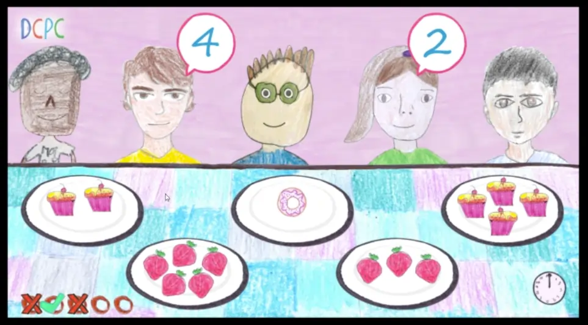

# Technical Test — De Criança Para Criança

This project is a technical test for [De Criança Para Criança](https://decriancaparacrianca.com.br/), a Brazilian platform that brings children's artwork to life by turning their drawings and paintings into interactive animations and games.

## About

The game is built with [Phaser 3](https://phaser.io/) and continues from a base project that they provided.

## Stack

- Phaser 3
- Vanilla JavaScript
